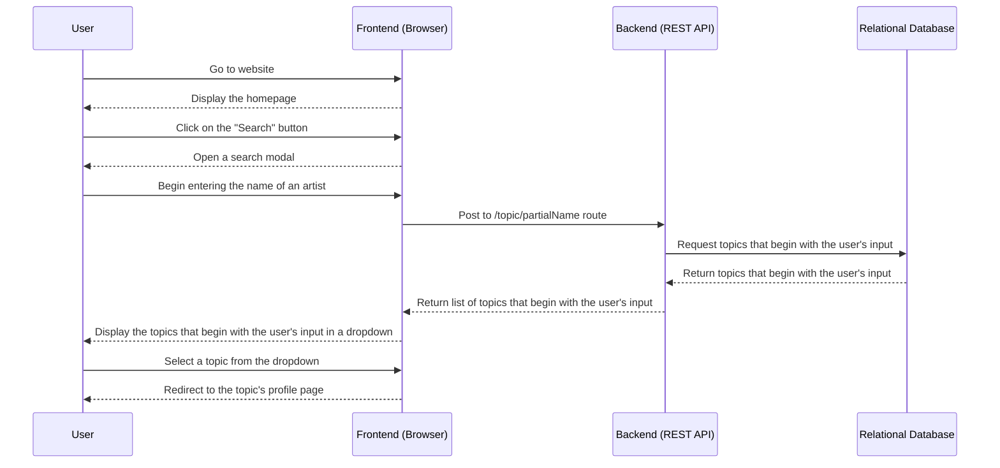

```mermaid
sequenceDiagram
    User->>Frontend (Browser): Go to website
    Frontend (Browser)-->>User: Display the homepage
    User->>Frontend (Browser): Click on the "Search" button
    Frontend (Browser)-->>User: Open a search modal
    User->>Frontend (Browser): Begin entering the name of an artist
    Frontend (Browser)->>Backend (REST API): Post to /topic/partialName route
    Backend (REST API)->>Relational Database: Request topics that begin with the user's input
    Relational Database-->>Backend (REST API): Return topics that begin with the user's input
    Backend (REST API)-->>Frontend (Browser): Return list of topics that begin with the user's input
    Frontend (Browser)-->>User: Display the topics that begin with the user's input in a dropdown
    User->>Frontend (Browser): Select a topic from the dropdown
    Frontend (Browser)-->>User: Redirect to the topic's profile page
```
