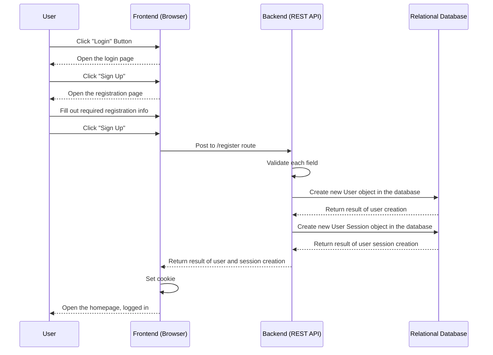

```mermaid
sequenceDiagram
    User->>Frontend (Browser): Click "Login" Button
    Frontend (Browser)-->>User: Open the login page
    User->>Frontend (Browser): Click "Sign Up"
        Frontend (Browser)-->>User: Open the registration page
    User->>Frontend (Browser): Fill out required registration info
    User->>Frontend (Browser): Click "Sign Up"
    Frontend (Browser)->>Backend (REST API): Post to /register route
    Backend (REST API)->>Backend (REST API): Validate each field
    Backend (REST API)->>Relational Database: Create new User object in the database
    Relational Database-->>Backend (REST API): Return result of user creation
    Backend (REST API)->>Relational Database: Create new User Session object in the database
    Relational Database-->>Backend (REST API): Return result of user session creation
    Backend (REST API)-->>Frontend (Browser): Return result of user and session creation
    Frontend (Browser)->>Frontend (Browser): Set cookie
    Frontend (Browser)-->>User: Open the homepage, logged in
```
