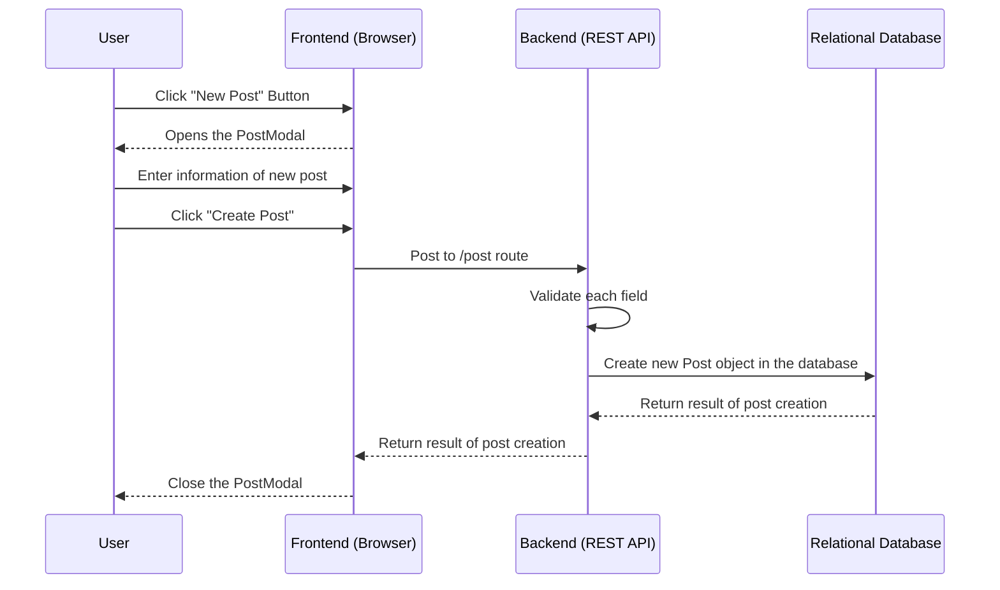

```mermaid
sequenceDiagram
    User->>Frontend (Browser): Click "New Post" Button
    Frontend (Browser)-->>User: Opens the PostModal
    User->>Frontend (Browser): Enter information of new post
    User->>Frontend (Browser): Click "Create Post"
    Frontend (Browser)->>Backend (REST API): Post to /post route
    Backend (REST API)->>Backend (REST API): Validate each field
    Backend (REST API)->>Relational Database: Create new Post object in the database
    Relational Database-->>Backend (REST API): Return result of post creation
    Backend (REST API)-->>Frontend (Browser): Return result of post creation
    Frontend (Browser)-->>User: Close the PostModal
```
