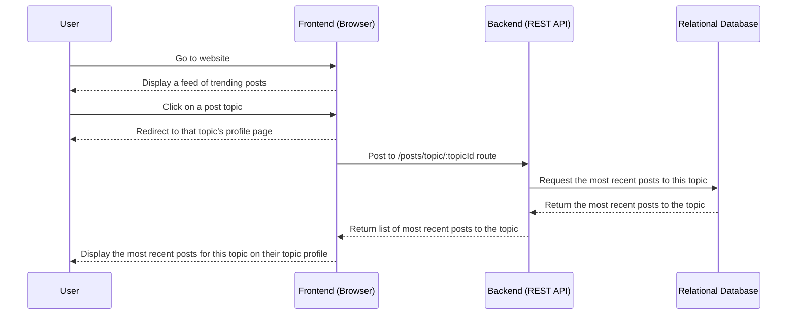

```mermaid
sequenceDiagram
    User->>Frontend (Browser): Go to website
    Frontend (Browser)-->>User: Display a feed of trending posts
    User->>Frontend (Browser): Click on a post topic
    Frontend (Browser)-->>User: Redirect to that topic's profile page
    Frontend (Browser)->>Backend (REST API): Post to /posts/topic/:topicId route
    Backend (REST API)->>Relational Database: Request the most recent posts to this topic
    Relational Database-->>Backend (REST API): Return the most recent posts to the topic
    Backend (REST API)-->>Frontend (Browser): Return list of most recent posts to the topic
    Frontend (Browser)-->>User: Display the most recent posts for this topic on their topic profile
```
