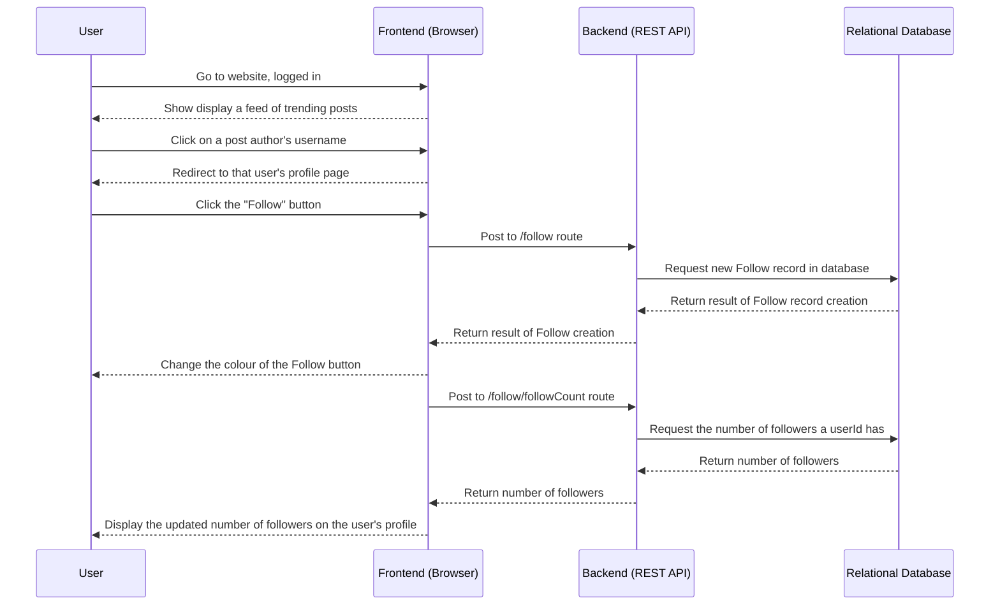

```mermaid
sequenceDiagram
    User->>Frontend (Browser): Go to website, logged in
    Frontend (Browser)-->>User: Show display a feed of trending posts
    User->>Frontend (Browser): Click on a post author's username
    Frontend (Browser)-->>User: Redirect to that user's profile page
    User->>Frontend (Browser): Click the "Follow" button
    Frontend (Browser)->>Backend (REST API): Post to /follow route
    Backend (REST API)->>Relational Database: Request new Follow record in database
    Relational Database-->>Backend (REST API): Return result of Follow record creation
    Backend (REST API)-->>Frontend (Browser): Return result of Follow creation
    Frontend (Browser)-->>User: Change the colour of the Follow button
    Frontend (Browser)->>Backend (REST API): Post to /follow/followCount route
    Backend (REST API)->>Relational Database: Request the number of followers a userId has
    Relational Database-->>Backend (REST API): Return number of followers
    Backend (REST API)-->>Frontend (Browser): Return number of followers
    Frontend (Browser)-->>User: Display the updated number of followers on the user's profile
```
