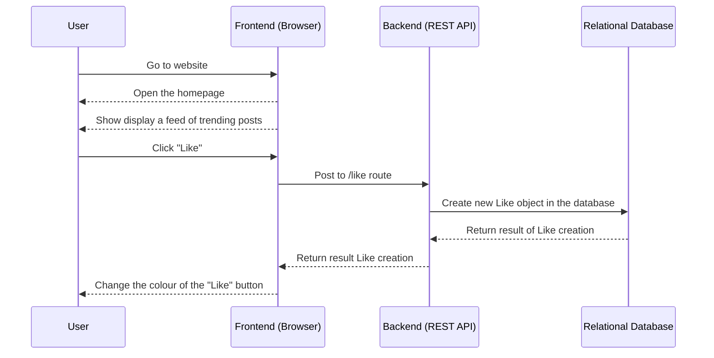

```mermaid
sequenceDiagram
    User->>Frontend (Browser): Go to website
    Frontend (Browser)-->>User: Open the homepage
    Frontend (Browser)-->>User: Show display a feed of trending posts
    User->>Frontend (Browser): Click "Like"
    Frontend (Browser)->>Backend (REST API): Post to /like route
    Backend (REST API)->>Relational Database: Create new Like object in the database
    Relational Database-->>Backend (REST API): Return result of Like creation
    Backend (REST API)-->>Frontend (Browser): Return result Like creation
    Frontend (Browser)-->>User: Change the colour of the "Like" button
```
